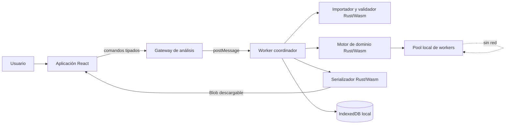
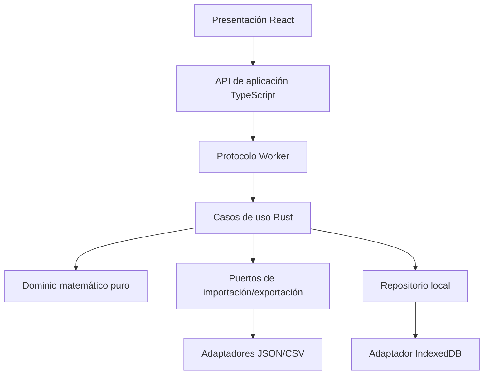
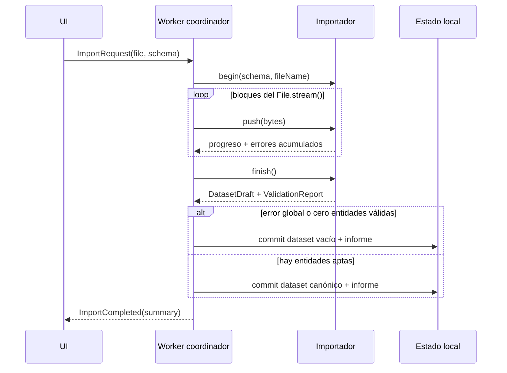

# Documento de diseño: Motor de recomendación y similitud

## Overview

### Propósito y alcance

El sistema será una aplicación web analítica local-first que importa una colección por ejecución, valida sus entidades, normaliza y pondera sus características, y produce tres resultados independientes: recomendaciones respecto de una entidad, agrupaciones globales y listas curadas respecto de un perfil. Todo dato del usuario se procesa en el dispositivo; la aplicación no contiene clientes HTTP, telemetría, sincronización remota ni dependencias de servicios externos en tiempo de ejecución.

La solución separa cuatro responsabilidades:

1. **Interfaz web:** selección de archivo y esquema, configuración, visualización, cancelación y descarga.
2. **Dominio matemático:** transformaciones, métricas, ranking, clustering, explicaciones y silueta.
3. **Importación/exportación:** lectura incremental de JSON/CSV, validación estructural y serialización determinista.
4. **Ejecución de análisis:** aislamiento del cálculo, control de memoria, progreso, cancelación y conservación transaccional del último resultado válido.

### Stack de referencia

- **Interfaz:** TypeScript, React y Vite, ejecutados como sitio estático/PWA.
- **Núcleo:** Rust compilado tanto como biblioteca nativa para pruebas/benchmarks como WebAssembly para producción web.
- **Puente:** `wasm-bindgen` con contratos binarios basados en arreglos tipados; no se cruzan objetos por fila durante cálculos masivos.
- **Ejecución:** un Web Worker coordinador y un pool fijo de workers de cálculo. En el perfil de rendimiento se habilita memoria compartida y aislamiento entre orígenes; si no está disponible, se usa un worker sin compartir memoria y se informa que el entorno no es el Entorno_de_Referencia homologado.
- **Persistencia local opcional:** IndexedDB para configuración válida, esquema y último resultado; el archivo fuente no se persiste salvo acción expresa del usuario.

### Hallazgos de investigación aplicados

- Los Web Workers permiten retirar el cálculo del hilo principal; IndexedDB también está disponible dentro de un worker, por lo que persistencia y cálculo pueden mantenerse fuera de la interfaz ([MDN: IndexedDB en WorkerGlobalScope](https://developer.mozilla.org/en-US/docs/Web/API/WorkerGlobalScope/indexedDB)).
- Rust/Wasm admite ejecutar módulos dentro de Web Workers, respaldando el aislamiento entre UI y núcleo ([wasm-bindgen: Wasm in Web Worker](https://rustwasm.github.io/docs/wasm-bindgen/examples/wasm-in-web-worker.html)).
- El núcleo se diseña como funciones sobre bytes y slices, dejando I/O al host, patrón recomendado para bibliotecas Rust destinadas a WebAssembly ([Rust and WebAssembly: soporte Wasm en crates](https://rustwasm.github.io/docs/book/reference/add-wasm-support-to-crate.html)).
- JSON y CSV se ajustan respectivamente a [RFC 8259](https://datatracker.ietf.org/doc/html/rfc8259.html) y [RFC 4180](https://datatracker.ietf.org/doc/html/rfc4180). CSV se emite con CRLF; ambos formatos se codifican como UTF-8 sin BOM.

Content was rephrased for compliance with licensing restrictions.

### Decisiones y límites

- Los números del dominio son `f64`. Se rechazan `NaN`, infinitos y booleanos antes de construir matrices.
- La matriz usa disposición contigua por filas. Se conservan matriz original y normalizada; el vector ponderado es una vista lógica `normalizado × peso`, calculada al operar, para evitar otra matriz de hasta 80 MB.
- La tolerancia de empate analítico es `EPS_TIE = 1e-9`; la normalización Z usa `EPS_Z = 1e-6` únicamente para su criterio de aceptación.
- La ordenación de identificadores es lexicográfica por valores escalares Unicode, sin locale, normalización Unicode ni distinción dependiente del sistema operativo.
- Un resultado nuevo solo sustituye al anterior al completar validación, cálculo y ensamblaje. Error o cancelación descartan el borrador.
- La primera versión no mezcla colecciones, no entrena modelos, no usa GPU y no envía datos fuera del proceso del navegador.

### Riesgo de factibilidad del requisito de rendimiento

La recomendación exacta es `O(N·M)` y el clustering por centroides es `O(I·N·K·M)`. Sin embargo, el representante euclidiano definido como menor **distancia** media y la silueta euclidiana exacta requieren en el peor caso `O(N²·M)` comparaciones; no existe un agregado de centroides que preserve exactamente la media de distancias euclidianas no cuadráticas para datos arbitrarios. Por ello, el límite de 120 segundos de 8.3 se trata como criterio empírico de aceptación en el Entorno_de_Referencia, no como garantía algorítmica para toda distribución de 100.000 × 100. El diseño mantiene exactitud mediante bloques y paralelismo, registra tiempos por fase y falla sin resultado parcial si se agota memoria, pero este punto requiere benchmark temprano. Si el benchmark no cumple, habrá que aclarar requisitos para permitir silueta/representante aproximados, muestreo, distancia euclidiana cuadrática o un límite menor; no se ocultará una aproximación como resultado exacto.

## Architecture

### Vista de contenedores



### Capas y reglas de dependencia



- Presentación desconoce fórmulas y formatos internos.
- El gateway desconoce React y expone promesas cancelables.
- Casos de uso coordinan validación y commits, pero no implementan fórmulas.
- El dominio puro no accede a DOM, archivos, reloj, aleatoriedad global, red ni IndexedDB.
- Importadores/serializadores dependen de modelos canónicos, nunca de componentes UI.
- La aleatoriedad se recibe como `SeededRng`; no se llama a `Math.random`.

### Flujo de importación



El parser es incremental. Para JSON acepta un documento completo conforme a RFC 8259 cuya colección de registros se indica en el Esquema_Declarado; para CSV usa encabezado único y no vacío tras `trim`. Un error global impide confiar en límites de registro y vacía el conjunto apto. Los errores de entidad se acumulan y excluyen la fila/objeto completo. Los duplicados se detectan en una segunda fase mediante mapa `identificador_recortado -> índices`; todas sus apariciones se rechazan.

### Flujo de análisis y commit transaccional

1. La UI construye una solicitud inmutable con `datasetId`, configuración y semilla.
2. El coordinador valida límites y configuración antes de reservar buffers analíticos.
3. Se normaliza o se reutiliza una transformación cacheada por huella de dataset + método.
4. El caso de uso ejecuta recomendación, clustering o lista curada en un área de trabajo temporal.
5. Se verifican invariantes del resultado: cardinalidad, orden, finitud, cobertura y configuración efectiva.
6. Solo entonces se asigna `resultId` y se sustituye el último resultado válido del mismo tipo.
7. La UI recibe un resumen paginado; exportación y detalles se consultan bajo demanda.

La cancelación usa `AbortSignal` en UI y un indicador atómico en workers. Cada bucle por bloques consulta el indicador. Cancelar equivale a fallo transaccional y no altera el último resultado.

### Estrategia de clustering

Se declaran dos métodos disponibles:

- `lloyd-euclidean-v1`, válido solo con Distancia_Euclidiana.
- `spherical-kmeans-v1`, válido solo con Similitud_Coseno.

Ambos reciben `K`, semilla, `maxIterations` (predeterminado 100) y `tolerance` (predeterminado `1e-8`). La combinación método/métrica incompatible es configuración inválida.

**Inicialización determinista:** variante k-means++ con PRNG `ChaCha8` sembrado. La primera entidad se elige por índice pseudoaleatorio; las siguientes, sin repetir entidad, mediante distribución proporcional a la disimilitud al centro más cercano. Si todas las disimilitudes restantes son cero, se elige el menor identificador aún no usado.

**Euclidiana:** asignación al centro de menor distancia euclidiana; actualización por media componente a componente. Para comparar centros o asignar se puede omitir la raíz porque preserva el orden, pero valores publicados, contribuciones, representantes y silueta usan la raíz exacta.

**Coseno esférico:** solo admite entidades con norma ponderada no cero. Cada vector se divide por su norma para el clustering; se asigna al centro con mayor producto punto y el centro actualizado se renormaliza. Si una suma de cluster tiene norma cero, se activa la reparación de centro/cluster descrita abajo.

**Clusters vacíos:** tras cada asignación se reparan antes de comprobar convergencia. Para cada cluster vacío, en orden de `clusterId`, se elige un cluster donante con más de una entidad y se mueve la entidad peor representada por su centro (mayor distancia euclidiana o menor coseno). Empates de pérdida se resuelven por identificador ascendente y luego `clusterId` donante. La entidad movida pasa a ser centro del cluster vacío. Se recalculan ambos centros. Como `2 ≤ K ≤ N`, siempre existe donante hasta eliminar todos los vacíos. El resultado no se publica si la reparación no logra exactamente K clusters no vacíos.

**Empates:** si dos valores de asignación o representación difieren a lo sumo `1e-9`, gana el menor `clusterId`; para representantes gana el menor Identificador_de_Entidad.

**Representantes:** un singleton se representa a sí mismo. En Euclidiana se calcula exactamente la media de distancias a los demás miembros en bloques triangulares; en Coseno se calcula la media de similitudes, que puede acelerarse con la suma de vectores unitarios del cluster sin cambiar el resultado matemático. Se aplica el desempate reglado.

**Silueta:** un singleton recibe 0. Para cada otra entidad se calcula `a` como disimilitud media a su cluster sin incluirse y `b` como la mínima disimilitud media a cada otro cluster. Se usa distancia euclidiana o `1 - coseno`. Si `max(a,b)=0`, el coeficiente es 0; de otro modo, `(b-a)/max(a,b)`. Se limita únicamente ruido de redondeo dentro de `1e-9` a `[-1,1]`; un exceso mayor es error interno. La silueta global es la media compensada (Kahan) de coeficientes individuales.

### Vectores cero

- Euclidiana está definida para cualquier vector finito, incluidos vectores cero.
- En recomendación coseno, una referencia de norma cero rechaza la solicitud y candidatos de norma cero se excluyen antes de contar K.
- En clustering coseno, cualquier Entidad_Apta con vector ponderado de norma cero hace inválida la solicitud, porque 4.2 exige asignar todas las entidades aptas y la métrica seleccionada no está definida para esa entidad. Se devuelve `ZERO_VECTOR_NOT_ALLOWED`, se identifican las entidades y se conserva la agrupación anterior.
- En lista curada coseno, un perfil de norma cero rechaza la solicitud; candidatos de norma cero se excluyen y se registra la causa. Esta regla deriva de la precondición de Similitud_Coseno del glosario y evita publicar `NaN`.
- Un centro esférico cuya suma sea cero se repara con la entidad peor representada; si aun así no puede obtenerse un centro no nulo, la agrupación falla sin resultado parcial.

## Components and Interfaces

### Presentación web

- `ImportWorkspace`: selecciona archivo, formato y esquema; presenta errores virtualizados.
- `DatasetInspector`: resumen, paginación y entidades aptas/rechazadas.
- `TransformConfigurator`: normalización y pesos; conserva la última configuración válida.
- `RecommendationPanel`, `ClusteringPanel`, `CuratedListPanel`: formularios y resultados separados, con etiquetas inequívocas.
- `ExportPanel`: JSON, CSV y texto legible; crea y revoca URLs de `Blob` localmente.
- `JobMonitor`: progreso por fase, tiempo, memoria estimada y cancelación.

La UI nunca recibe la matriz completa. Solicita páginas de entidades/resultados y series agregadas.

### API de aplicación TypeScript

```ts
interface AnalysisGateway {
  importDataset(request: ImportRequest, signal?: AbortSignal): Promise<ImportSummary>;
  configureTransform(request: TransformRequest): Promise<TransformSummary>;
  recommend(request: RecommendationRequest, signal?: AbortSignal): Promise<ResultSummary>;
  cluster(request: ClusteringRequest, signal?: AbortSignal): Promise<ResultSummary>;
  curate(request: CuratedListRequest, signal?: AbortSignal): Promise<ResultSummary>;
  getPage(request: PageRequest): Promise<ResultPage>;
  export(request: ExportRequest, signal?: AbortSignal): Promise<Blob>;
  formatReadable(request: FormatRequest): Promise<string>;
}
```

El protocolo `postMessage` usa unión discriminada `{ requestId, type, payload }` y responde `{ requestId, ok, payload | error }`. Buffers de entrada no compartidos se transfieren, no se clonan.

### Casos de uso Rust

```rust
pub trait ImportPort {
    fn begin(&mut self, schema: DeclaredSchema, source: SourceInfo) -> Result<(), DomainError>;
    fn push(&mut self, bytes: &[u8]) -> Result<ImportProgress, DomainError>;
    fn finish(&mut self) -> ImportOutcome;
}

pub trait AnalysisEngine {
    fn transform(&self, data: &Dataset, cfg: &TransformConfig) -> Result<TransformedDataset, DomainError>;
    fn recommend(&self, data: &TransformedDataset, req: &RecommendationRequest) -> Result<Recommendation, DomainError>;
    fn cluster(&self, data: &TransformedDataset, req: &ClusteringRequest, cancel: &dyn CancelToken) -> Result<Clustering, DomainError>;
    fn curate(&self, data: &TransformedDataset, req: &CuratedListRequest) -> Result<CuratedList, DomainError>;
}

pub trait ExportPort {
    fn json(&self, value: &Exportable) -> Result<Vec<u8>, DomainError>;
    fn csv(&self, value: &Exportable, schema: &DeclaredSchema) -> Result<Vec<u8>, DomainError>;
    fn readable(&self, value: &Exportable, schema: &DeclaredSchema) -> Result<String, DomainError>;
}
```

### Servicios matemáticos puros

- `Validator`: esquema, IDs, números, límites y configuraciones.
- `Normalizer`: estadísticos en dos pasadas con Welford para Z y barrido min/max.
- `Metric`: `euclidean`, `cosine`, contribuciones y comparación tolerante.
- `Ranker`: top-K acotado con heap y orden total determinista.
- `PreferenceBuilder`: media componente a componente de vectores normalizados distintos.
- `EligibilityEvaluator`: AND de filtros, sin coerciones implícitas.
- `Clusterer`: inicialización, asignación, actualización, reparación y convergencia.
- `ClusterExplainer`: representantes, agregados y silueta.
- `ResultVerifier`: invariantes antes del commit.

### Interfaces de persistencia local

```ts
interface LocalRepository {
  loadLastValidConfig(): Promise<EffectiveConfig | undefined>;
  saveLastValidConfig(config: EffectiveConfig): Promise<void>;
  saveResultAtomically(kind: ResultKind, result: StoredResult): Promise<void>;
  loadResult(kind: ResultKind): Promise<StoredResult | undefined>;
  clearSession(): Promise<void>;
}
```

IndexedDB se versiona por `systemVersion`. Una transacción escribe encabezado, páginas y marcador `committed`; lecturas ignoran registros sin marcador. Cuotas insuficientes deshabilitan persistencia, no el análisis en memoria.

## Data Models

### Modelos canónicos

```ts
type FieldType = "id" | "number" | "string" | "boolean" | "nullable-number" | "nullable-string";
type MissingEncoding = { nullToken?: string; emptyIsValue: boolean; absentAllowed: boolean };

interface DeclaredField {
  name: string;
  type: FieldType;
  required: boolean;
  role: "identifier" | "feature" | "metadata";
  missing: MissingEncoding;
}

interface DeclaredSchema {
  fields: DeclaredField[]; // orden autoritativo
  jsonRecordsPath: string;
  csvDelimiter: ",";
}

interface Dataset {
  datasetId: string;       // hash local de contenido canónico + esquema
  source: SourceInfo;
  schema: DeclaredSchema;
  entityIds: string[];     // ya recortados y únicos
  original: Float64Array;  // N × M, row-major
  metadata: ColumnStore;
  acceptedSourcePositions: Uint32Array;
  validation: ValidationReport;
}

interface TransformedDataset {
  datasetId: string;
  normalized: Float64Array;
  transform: TransformParameters;
  weights: Float64Array;
  weightedNorms: Float64Array;
  effectiveConfig: EffectiveConfig;
}
```

`ColumnStore` conserva por campo metadatos los estados `present(value)`, `null`, `empty` y `absent` en buffers separados, para soportar round-trip. Las características requeridas nunca llegan nulas al `Dataset` apto.

### Validación e informe

```ts
type ErrorScope = "global" | "entity" | "configuration" | "analysis" | "internal";

interface ValidationIssue {
  code: string;
  scope: ErrorScope;
  fileName: string;
  record?: number;
  field?: string;
  entityId?: string;
  messageKey: string;
  details: Record<string, string | number>;
}

interface ValidationReport {
  issues: ValidationIssue[];
  acceptedCount: number;
  rejectedCount: number;
  globalErrorCount: number;
}
```

Los errores se ordenan por archivo, registro, campo y código. Para no agotar memoria con entradas hostiles, se guardan hasta 100.000 detalles y siempre los totales completos; alcanzar el límite añade `REPORT_DETAILS_TRUNCATED` sin alterar aceptados/rechazados.

### Transformación

```ts
type NormalizationMethod = "min-max" | "z-score";
type SimilarityMetric = "euclidean" | "cosine";

type TransformParameters =
  | { method: "min-max"; min: Float64Array; max: Float64Array }
  | { method: "z-score"; mean: Float64Array; populationStdDev: Float64Array };

interface TransformConfig {
  method: NormalizationMethod;
  weightsByFeature: Record<string, number>;
}

interface EffectiveConfig {
  normalization: NormalizationMethod;
  parameters: TransformParameters;
  weights: Float64Array;
  metric: SimilarityMetric;
  seed: bigint;
  analyticParameters: Record<string, string | number | boolean>;
  systemVersion: string;
}
```

Para característica `j` y entidad `i`:

- Min-max, si `max_j != min_j`: `n_ij = (x_ij - min_j) / (max_j - min_j)`.
- Z, si `σ_j != 0`: `n_ij = (x_ij - μ_j) / σ_j`, con `μ_j = (Σ_i x_ij)/N`, `σ_j = sqrt((Σ_i (x_ij-μ_j)²)/N)`.
- Si la varianza es cero o `N=1`: `n_ij = 0`.
- Ponderación: `w_ij = n_ij · peso_j`; peso omitido vale 1 y peso 0 no modifica `n_ij`.

Los parámetros se calculan solo con Entidades_Aptas. Un peso inválido rechaza el bloque completo y no cambia la configuración persistida.

### Métricas, ranking y contribuciones

Para vectores ponderados `x`, `y`:

- `d(x,y) = sqrt(Σ_j (x_j-y_j)²)`.
- Contribución euclidiana `c_j = (x_j-y_j)²`, por lo que `d = sqrt(Σ_j c_j)`.
- `s(x,y) = (Σ_j x_j y_j)/(||x||·||y||)` con ambas normas no nulas.
- Contribución coseno `c_j = (x_j y_j)/(||x||·||y||)`, por lo que `s = Σ_j c_j`.

Las sumas usan acumulación compensada cuando afectan valores publicados. El producto coseno se limita a `[-1,1]` solo si excede por redondeo hasta `1e-12`; otro exceso genera error interno. El comparador primero considera empate si `|a-b| ≤ 1e-9`, después ID Unicode ascendente. En distancia gana menor valor; en coseno, mayor.

```ts
interface RankedItem {
  position: number;
  entityId: string;
  comparisonValue: number;
  contributions?: Float64Array;
}

interface Recommendation {
  kind: "entity-recommendation";
  referenceId: string;
  items: RankedItem[];
  effectiveConfig: EffectiveConfig;
}
```

El top-K mantiene un heap de tamaño K y luego aplica el comparador total. La referencia se excluye siempre.

### Clustering

```ts
interface ClusteringRequest {
  datasetId: string;
  clusterCount: number;
  method: "lloyd-euclidean-v1" | "spherical-kmeans-v1";
  metric: SimilarityMetric;
  seed: bigint;
  maxIterations?: number;
  tolerance?: number;
}

interface ClusterSummary {
  clusterId: number;
  memberCount: number;
  representativeId: string;
  normalizedMeans: Float64Array;
  weightedMeans: Float64Array;
}

interface Clustering {
  kind: "global-unordered-clustering";
  assignmentByEntity: Uint32Array;
  clusters: ClusterSummary[];
  individualSilhouettes: Float64Array;
  silhouette: number;
  effectiveConfig: EffectiveConfig;
}
```

`clusterId` es estable dentro del resultado y se canoniza al final ordenando clusters por el menor ID miembro; las asignaciones se remapean. Exportación no interpreta ese ID como ranking.

### Perfil, filtros y lista curada

```ts
type EligibilityFilter =
  | { field: string; op: "eq" | "in"; value: unknown }
  | { field: string; op: "gte" | "lte" | "between"; value: number | [number, number] };

interface PreferenceProfile {
  selectedEntityIds: string[];
  normalizedVector: Float64Array;
}

interface CuratedList {
  kind: "personalized-selection";
  profile: PreferenceProfile;
  filters: EligibilityFilter[];
  items: RankedItem[];
  emptyReason?: "FILTERS_EXCLUDED_ALL" | "NO_DISTINCT_CANDIDATES" | "NO_COSINE_CANDIDATES";
  effectiveConfig: EffectiveConfig;
}
```

El perfil es `p_j = (Σ_{i∈P} n_ij)/|P|`, antes de aplicar pesos para comparar. Las preferencias deben ser distintas y aptas. Los filtros se evalúan en conjunto; campo ausente implica `false`. Primero se excluyen preferencias, después filtros, luego vectores cero de coseno, y finalmente se cuenta y ordena. Un K inválido no cambia perfil ni filtros vigentes.

### Exportación

El modelo exportable contiene versión de contrato, tipo de resultado, esquema, configuración efectiva y registros. JSON preserva tipos y estados de ausencia mediante la estructura definida por el esquema. CSV aplica el token de nulo/ausente del Esquema_Declarado y escapa comillas, comas y saltos conforme a RFC 4180. Recomendación/lista se exportan por posición; clustering por identificador Unicode; texto legible sigue el orden del esquema y es estable byte a byte para la misma entrada y versión.

## Correctness Properties

*Una propiedad es una característica o comportamiento que debe mantenerse en todas las ejecuciones válidas de un sistema; es decir, una afirmación formal sobre lo que el sistema debe hacer. Las propiedades sirven de puente entre especificaciones legibles por personas y garantías de corrección verificables por una máquina.*

La reflexión posterior al prework consolidó criterios que expresaban la misma invariante. Los casos singulares, contratos de presentación, infraestructura y rendimiento permanecen en pruebas unitarias, de integración, smoke o benchmarks en lugar de forzarse como propiedades.

### Property 1: Correspondencia de registros JSON válidos

Para todo (`for all`) Esquema_Declarado y documento JSON válido conforme a él, importar el documento produce exactamente una Entidad, en el mismo orden, por cada Registro válido.

**Validates: Requirements 1.1**

### Property 2: Correspondencia y encabezados CSV

Para todo (`for all`) CSV válido conforme al Esquema_Declarado, con encabezados recortados únicos y no vacíos y al menos una característica, la importación produce exactamente una Entidad por fila no vacía; cualquier violación de esas condiciones de encabezado produce un Error_Global.

**Validates: Requirements 1.2**

### Property 3: Canonización y límites de identificadores

Para toda (`for all`) cadena candidata a identificador, el identificador aceptado es exactamente su valor sin espacios iniciales/finales si y solo si su longitud resultante está entre 1 y 255 caracteres.

**Validates: Requirements 1.3**

### Property 4: Unicidad de identificadores canonizados

Para toda (`for all`) colección de entidades, la unicidad se calcula sobre identificadores recortados y ninguna aparición de una clave repetida pertenece al conjunto de Entidades_Aptas.

**Validates: Requirements 1.4, 1.5**

### Property 5: Aislamiento de entidades inválidas

Para toda (`for all`) colección con cualquier combinación de valores de característica, solo los números reales finitos se aceptan y toda entidad que contenga al menos un Error_de_Entidad queda excluida por completo de cualquier entrada analítica, sin excluir otras entidades válidas.

**Validates: Requirements 1.6, 1.7, 1.10**

### Property 6: Exactitud del informe de validación

Para toda (`for all`) importación, el Informe_de_Validación contiene una entrada localizada por cada rechazo observado y sus conteos de aceptadas y rechazadas coinciden con la partición de registros evaluados.

**Validates: Requirements 1.9**

### Property 7: Normalización min-max

Para toda (`for all`) matriz finita y toda columna no constante, cada valor min-max satisface `(x-min)/(max-min)`, el mínimo transformado es 0, el máximo es 1 y todos los valores están en `[0,1]` dentro del error numérico especificado.

**Validates: Requirements 2.1**

### Property 8: Estandarización poblacional

Para toda (`for all`) matriz finita bien condicionada y toda columna no constante, la transformación Z usa divisor `N`, cada componente satisface `(x-μ)/σ_poblacional` y la columna resultante tiene media 0 y desviación poblacional 1 con tolerancia absoluta `1e-6`.

**Validates: Requirements 2.2, 2.3**

### Property 9: Columnas constantes se transforman en cero

Para toda (`for all`) columna finita de varianza cero, incluido cualquier dataset con `N=1`, ambos métodos de normalización producen cero en esa característica para todas las entidades.

**Validates: Requirements 2.4**

### Property 10: Ponderación componente a componente

Para todo (`for all`) vector normalizado y vector de pesos finitos no negativos, cada componente ponderado es el producto correspondiente; donde el peso es cero el ponderado es cero y el vector normalizado permanece sin cambios.

**Validates: Requirements 2.5, 2.7**

### Property 11: Atomicidad de configuración de pesos

Para toda (`for all`) configuración válida vigente, sustituir cualquier peso por un valor negativo, no numérico o no finito rechaza la configuración completa, localiza la característica y deja byte a byte intacta la configuración válida previa.

**Validates: Requirements 2.8**

### Property 12: Recomendación euclidiana completa

Para todo (`for all`) dataset transformado, referencia apta y K válido con métrica euclidiana, la recomendación contiene `min(K,candidatos)` entidades distintas de la referencia, sus valores son las distancias euclidianas recalculadas y el orden es ascendente, resolviendo diferencias de hasta `1e-9` por identificador ascendente.

**Validates: Requirements 3.1, 3.2, 3.3, 3.6**

### Property 13: Recomendación coseno completa

Para todo (`for all`) dataset transformado con referencia no nula y K válido, la recomendación coseno excluye candidatos de norma cero, contiene `min(K,candidatos no nulos)` elementos, publica su coseno correcto y los ordena de mayor a menor con desempate por identificador dentro de `1e-9`.

**Validates: Requirements 3.1, 3.4, 3.5, 3.6, 3.9**

### Property 14: Partición total en K clusters no vacíos

Para todo (`for all`) dataset y configuración de clustering válidos, el resultado asigna cada Entidad_Apta exactamente una vez, produce exactamente K clusters, cada conteo es positivo y la suma de conteos es N, incluso cuando una iteración intermedia produzca clusters vacíos.

**Validates: Requirements 4.2, 4.3, 6.6**

### Property 15: Atomicidad de parámetros de clustering

Para toda (`for all`) agrupación válida vigente y toda mutación que haga inválido el método o uno de sus parámetros, la solicitud se rechaza sin resultado parcial y la agrupación vigente permanece idéntica.

**Validates: Requirements 4.5**

### Property 16: Representante óptimo y determinista

Para todo (`for all`) cluster no vacío, su representante es el único miembro si es unitario; en otro caso minimiza la distancia euclidiana media o maximiza la similitud coseno media según la métrica, y todo empate dentro de `1e-9` selecciona el menor identificador.

**Validates: Requirements 4.7, 4.8, 4.9, 4.10**

### Property 17: Silueta exacta, agregada y acotada

Para toda (`for all`) partición válida, cada singleton tiene coeficiente 0; cada otro miembro usa `a` y el mínimo `b` calculados con distancia euclidiana o `1-coseno`, produce 0 si `max(a,b)=0` y en otro caso `(b-a)/max(a,b)`; la silueta global es la media de los individuales y pertenece a `[-1,1]` dentro de `1e-9`.

**Validates: Requirements 4.11, 4.12, 4.13, 4.14, 4.15, 4.16**

### Property 18: Perfil como centroide normalizado

Para todo (`for all`) subconjunto no vacío de Entidades_Aptas distintas, cada componente del Perfil_de_Preferencia es la media aritmética del mismo componente en los Vectores_Normalizados seleccionados.

**Validates: Requirements 5.1**

### Property 19: Conjunto elegible de lista curada

Para todo (`for all`) perfil, dataset y conjunto de filtros, los candidatos de la lista son exactamente las entidades aptas que no son preferencias, contienen todos los campos requeridos y satisfacen simultáneamente todos los filtros; su cantidad final es `min(K,candidatos elegibles)`.

**Validates: Requirements 5.2, 5.3, 5.4, 5.5**

### Property 20: Orden total de lista curada

Para toda (`for all`) lista curada válida, sus elementos están ordenados respecto del perfil por distancia ascendente o coseno descendente según la métrica, y valores con diferencia absoluta de hasta `1e-9` están ordenados por identificador ascendente.

**Validates: Requirements 5.6, 5.7, 5.8**

### Property 21: Atomicidad de K en lista curada

Para todo (`for all`) perfil y filtros vigentes, solicitar una lista con K no entero o menor que 1 produce un error y conserva sin modificación el perfil y los filtros.

**Validates: Requirements 5.12**

### Property 22: Recalculabilidad de valores publicados

Para toda (`for all`) recomendación publicada, recalcular el valor de comparación desde los vectores ponderados y la configuración efectiva reproduce el valor asociado con tolerancia absoluta `1e-9`.

**Validates: Requirements 6.1**

### Property 23: Descomposición de distancia euclidiana

Para todo (`for all`) par de vectores ponderados finitos, cada contribución euclidiana es `(x_j-y_j)²` y la raíz de la suma de contribuciones reproduce la distancia con tolerancia absoluta `1e-9`.

**Validates: Requirements 6.2, 6.3**

### Property 24: Descomposición de similitud coseno

Para todo (`for all`) par de vectores ponderados de norma no nula, cada contribución coseno es `(x_j·y_j)/(||x||·||y||)` y su suma reproduce la similitud con tolerancia absoluta `1e-9`.

**Validates: Requirements 6.4, 6.5**

### Property 25: Medias de cluster verificables

Para toda (`for all`) agrupación válida, cada media publicada por cluster y característica coincide, dentro de `1e-9`, con la media recalculada de los valores normalizados y ponderados de sus miembros.

**Validates: Requirements 6.7**

### Property 26: Round-trip JSON conforme

Para todo (`for all`) dataset válido, serializarlo a JSON UTF-8 sin BOM y reimportarlo produce un documento RFC 8259 y un dataset equivalente en orden, IDs, campos, tipos, valores y distinción entre nulo, vacío y ausente.

**Validates: Requirements 7.1, 7.7**

### Property 27: Round-trip CSV conforme al esquema

Para todo (`for all`) dataset válido representable por su Esquema_Declarado, serializarlo a CSV UTF-8 sin BOM con CRLF y reimportarlo con ese esquema produce un dataset equivalente, incluso con comas, comillas, saltos, Unicode y estados nulo/vacío/ausente.

**Validates: Requirements 7.2, 7.8**

### Property 28: Formato legible determinista

Para todo (`for all`) dataset o resultado, dos formateos con la misma versión producen exactamente los mismos bytes, con campos en orden de esquema y colecciones por posición o, si no existe, por identificador Unicode ascendente.

**Validates: Requirements 7.3**

### Property 29: Exportación preserva semántica y orden del resultado

Para todo (`for all`) resultado analítico, exportar y volver a interpretar conserva todos los campos: recomendación y lista mantienen posiciones y orden; agrupación mantiene el mapa entidad-cluster y ordena registros por identificador Unicode.

**Validates: Requirements 7.4, 7.5, 7.6**

### Property 30: Prevalidación y atomicidad de límites

Para toda (`for all`) solicitud cuyos valores excedan un límite declarado, el validador la rechaza antes de invocar el algoritmo, informa límite y valor recibido, no publica parciales y conserva el dataset cargado.

**Validates: Requirements 8.5, 8.6**

### Property 31: Reproducibilidad transversal

Para todo (`for all`) dataset, Configuración_Efectiva y Versión_del_Sistema idénticos, dos ejecuciones del mismo tipo producen la misma representación canónica de identificadores, orden, valores y, cuando corresponda, asignaciones de cluster.

**Validates: Requirements 4.17, 8.7**

## Error Handling

### Taxonomía

| Categoría | Ejemplos de código | Efecto |
|---|---|---|
| Global de importación | `MALFORMED_JSON`, `MALFORMED_CSV`, `INVALID_SCHEMA`, `DUPLICATE_HEADER`, `EMPTY_HEADER` | Dataset apto vacío; se conserva y presenta informe |
| De entidad | `INVALID_ID_LENGTH`, `DUPLICATE_ID`, `NON_FINITE_FEATURE`, `MISSING_REQUIRED_FIELD` | Se excluye toda la entidad; continúa con otras |
| De configuración | `INVALID_WEIGHT`, `UNSUPPORTED_METRIC`, `INVALID_K`, `INVALID_CLUSTER_METHOD`, `INVALID_METHOD_PARAMETER` | Se rechaza el bloque y se conserva configuración/estado válido anterior |
| Matemático | `ZERO_REFERENCE_VECTOR`, `ZERO_PROFILE_VECTOR`, `ZERO_VECTOR_NOT_ALLOWED`, `UNDEFINED_COSINE` | No se publica resultado; candidatos cero se excluyen solo donde está definido |
| De clustering | `EMPTY_CLUSTER_REPAIR_FAILED`, `CLUSTER_COUNT_MISMATCH`, `NON_CONVERGENT`, `INVALID_SILHOUETTE` | Se descarta el borrador y se conserva agrupación anterior |
| De recursos | `LIMIT_EXCEEDED`, `OUT_OF_MEMORY`, `LOCAL_QUOTA_EXCEEDED`, `CANCELLED` | Sin parcial; cuota local puede degradar a sesión en memoria |
| Interno | `NON_FINITE_RESULT`, `INVARIANT_VIOLATION`, `WORKER_CRASHED` | Resultado descartado, diagnóstico local con `requestId` sin incluir datos sensibles |

### Contrato de error

```ts
interface AppError {
  code: string;
  category: "import" | "entity" | "configuration" | "math" | "resource" | "internal";
  messageKey: string;
  recoverable: boolean;
  requestId: string;
  location?: { file?: string; record?: number; field?: string; entityId?: string };
  details: Record<string, string | number>;
}
```

Los mensajes visibles se localizan en UI; el dominio devuelve códigos estables. No se incluyen filas completas ni vectores en logs. La UI ofrece corregir configuración, volver a importar o reducir tamaño. Un fallo de worker lo recrea una vez, pero nunca reintenta automáticamente una operación no confirmada ni cambia la semilla.

### Validación por frontera

1. **Antes del parsing:** formato, tamaño de archivo configurable y esquema básico.
2. **Durante parsing:** sintaxis, tipos, campos, IDs y números; se cuentan bytes/registros para progreso.
3. **Después del parsing:** duplicados, cero entidades válidas y límites N/M.
4. **Antes de transformar:** método y pesos completos/finito/no negativos.
5. **Antes de analizar:** K, método/métrica, preferencias, filtros, normas cero y límites de clusters.
6. **Antes de commit:** finitud, cardinalidad, orden, cobertura, clusters no vacíos, rango de silueta y presencia de Configuración_Efectiva.

### Semántica de conservación

Cada tipo de resultado tiene su propio slot `lastValid`. Un error en recomendación no altera clustering ni lista, y viceversa. Una importación completada con error global sí establece el dataset actual como vacío conforme al requisito 1.8, pero no borra exportaciones ya descargadas. La configuración inválida nunca sustituye `lastValidConfig`.

## Testing Strategy

### Pirámide de pruebas

1. **Unitarias Rust:** parsers por tokens, validadores, normalización, métricas, comparadores, filtros, reparación de clusters, silueta, serializadores y errores. Se cubren explícitamente fronteras 0/1/255/256, K, `N=1`, varianza cero, pesos cero, normas cero, `max(a,b)=0`, singletons, empates a ambos lados de `1e-9`, CRLF, comillas, BOM y Unicode.
2. **Property-based testing:** `proptest` en el crate de dominio nativo. Generadores producen matrices finitas acotadas, esquemas, Unicode, particiones, filtros y modelos exportables. Se evita generar NaN por accidente salvo en estrategias de rechazo.
3. **Integración Rust/Wasm/TypeScript:** contratos `wasm-bindgen`, transferencia de buffers, protocolo request/response, cancelación, crash/reinicio de worker y commit IndexedDB.
4. **Componentes UI:** React Testing Library para habilitación de controles, etiquetas exclusivas, conservación visual del último resultado, paginación y mensajes; snapshots solo para contratos de render estables.
5. **E2E offline:** Playwright con red bloqueada: importar fixtures, ejecutar los tres análisis, exportar y reimportar, recargar persistencia y cancelar trabajos.
6. **Compatibilidad:** navegadores Chromium y Firefox de las dos últimas versiones estables; el perfil de rendimiento se homologa en una versión fijada y se registra junto a Versión_del_Sistema.

### Configuración de property tests

Cada una de las 31 propiedades se implementa con **una única prueba** `proptest`, mínimo 100 casos exitosos (`ProptestConfig { cases: 100, .. }`). Casos con precondiciones difíciles usan generadores constructivos en vez de descartar masivamente. Toda prueba incluye un comentario con el formato obligatorio:

```rust
// Feature: motor-recomendacion-similitud, Property 23: Descomposición de distancia euclidiana
proptest! {
    #![proptest_config(ProptestConfig::with_cases(100))]
    #[test]
    fn euclidean_contributions_decompose_distance(pair in finite_vector_pair()) {
        // ...
    }
}
```

Las propiedades numéricas usan comparación absoluta indicada por el requisito; cuando no se especifica tolerancia, el oráculo emplea cálculo independiente y tolerancia proporcional documentada sin relajar los criterios publicados. Cada fallo conserva la semilla/caso mínimo para reproducción.

### Pruebas de ejemplo y bordes

- Error global y cero entidades válidas producen dataset vacío (1.8).
- Peso omitido vale 1 y configuración efectiva contiene parámetros/pesos (2.6, 2.9).
- Referencia no apta, referencia coseno cero, K inválido y métrica desconocida conservan recomendación anterior (3.7, 3.8, 3.10, 3.11).
- Método/K faltante, K inválido, salida inyectada con cluster vacío, singleton y etiquetado global (4.1, 4.4, 4.6, 4.7, 4.18, 4.19).
- Perfil coseno cero y clustering coseno con vector cero rechazan con código específico, sin `NaN` ni parcial.
- Campo de filtro ausente, lista vacía por filtros y lista vacía por falta de candidatos registran causas diferentes; etiqueta personalizada exclusiva (5.5, 5.9, 5.10, 5.11).
- Cada tipo de resultado contiene Configuración_Efectiva completa (6.8).

### Integración, rendimiento y memoria

Se crea un ejecutable benchmark nativo del mismo crate Rust y una suite E2E Wasm. Los datasets se generan offline con semilla fija y se almacenan como fixtures/manifiestos reproducibles.

- **Validación:** N entre 2 y 100.000, M entre 2 y 100; medir RSS del proceso y exigir ≤16 GB.
- **Recomendación:** 100.000 × 100 ya normalizado; una ejecución de calentamiento no medida y luego cinco ejecuciones completas, cada una ≤5 s.
- **Clustering:** 100.000 × 100 y matriz de K representativa que incluya 2 y 100; cinco ejecuciones por configuración, cada una ≤120 s. El reporte separa inicialización, iteraciones, reparación, representantes, silueta y serialización para aislar la fase cuadrática.
- **Concurrencia:** pool máximo `min(8, hardwareConcurrency)`; no existe carga concurrente durante homologación.
- **Memoria:** presupuestos previos por buffers, liberación por fases y medición de RSS máxima desde solicitud hasta respuesta. Se prueba entrada hostil sin reservar según tamaños no validados.

El criterio 8.3 no se considera validado hasta ejecutar el benchmark exacto en el Entorno_de_Referencia. Si falla, se vuelve a requisitos para resolver el conflicto entre exactitud cuadrática y plazo; no se cambia silenciosamente a aproximación.

### Privacidad y seguridad local

- CSP predeterminada: `default-src 'self'; connect-src 'none'; worker-src 'self' blob:`; assets, fuentes y Wasm empaquetados localmente.
- Prueba E2E intercepta `fetch`, XHR, WebSocket, beacon y solicitudes de recursos después de cargar la app; el análisis debe emitir cero solicitudes.
- Auditoría de bundle rechaza URLs remotas, SDKs de telemetría y source maps con datos de fixtures.
- Los datos permanecen en memoria/IndexedDB del origen local; “borrar sesión” elimina stores y revoca blobs.
- Los benchmarks y mediciones usan herramientas del equipo local, nunca observabilidad remota.

### Criterios de salida de implementación

La funcionalidad está lista cuando: todas las pruebas unitarias, propiedades e integración pasan; los round-trips preservan estados; E2E funciona offline; no se publican resultados parciales; las pruebas de cero vector/cluster vacío/desempate pasan; y los benchmarks cumplen 8.1–8.3 en el Entorno_de_Referencia. Todo artefacto de benchmark registra versión, navegador/runtime, semilla, dimensiones, configuración y huella del fixture.
